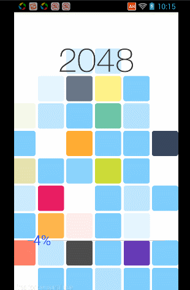
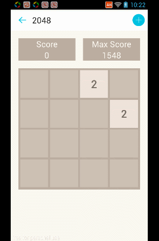
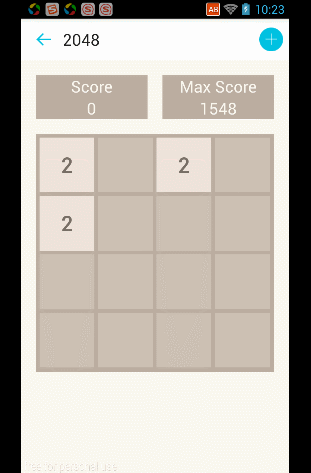
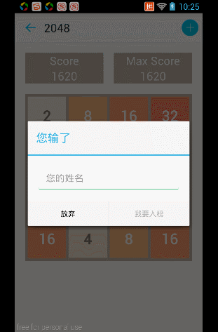
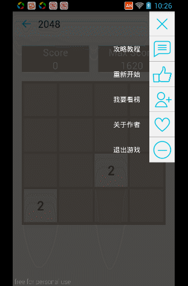

###Android2048

本人博客：[smallsoho.com](smallsoho.com)

包括各种特效，功能包括：

- 排行榜功能实现
- 正常游戏界面
- 攻略教程
- 开始游戏界面

###使用到的开源库

TextView水波纹动画  [https://github.com/RomainPiel/Titanic](https://github.com/RomainPiel/Titanic)

开始界面滚动条  [https://github.com/daimajia/NumberProgressBar](https://github.com/daimajia/NumberProgressBar)

好看的菜单  [https://github.com/Yalantis/Context-Menu.Android](https://github.com/Yalantis/Context-Menu.Android)

可滑动的ListView [https://github.com/baoyongzhang/SwipeMenuListView](https://github.com/baoyongzhang/SwipeMenuListView)

###展示

